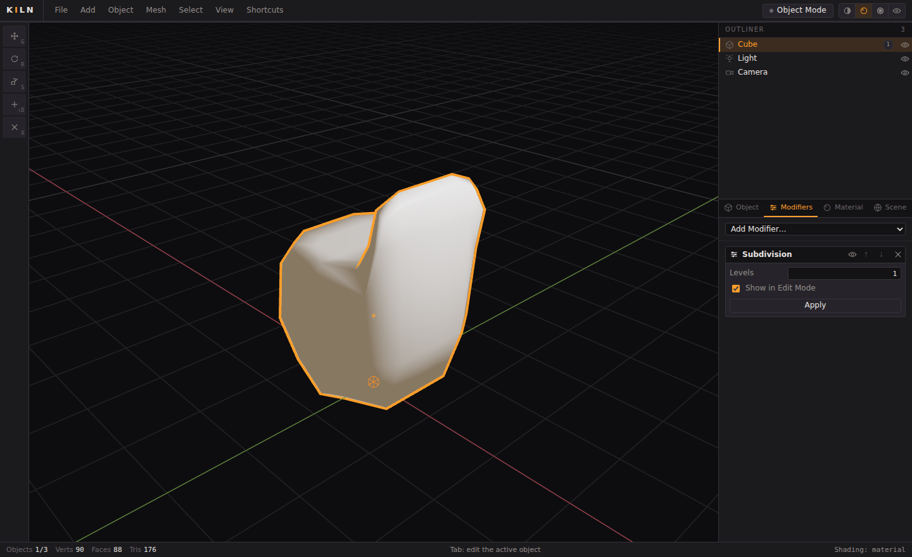
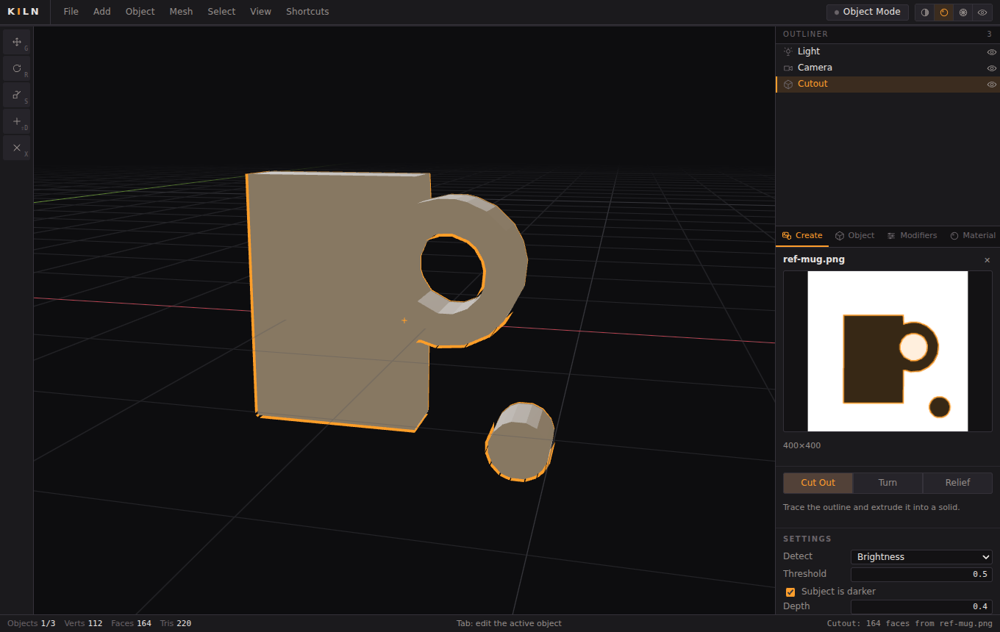

# Kiln

**A 3D modelling application for your desktop — and your browser.** Kiln is an
open source alternative to Blender's modelling workflow: mesh editing, a
non-destructive modifier stack, PBR materials and glTF export, in dependency-free
TypeScript. Drop in a photo or a video and it builds geometry from it. No
account, no server; nothing you open ever leaves your machine.



Kiln runs two ways: as a **desktop app** you double-click, or as a page in a
browser tab. Same code either way.

### Get the desktop app

Grab the build for your platform from the
[Releases page](https://github.com/22500107zc/yes/releases):

- **macOS** — `Kiln-0.1.0-universal.pkg`, one file for both Apple Silicon and
  Intel, which installs Kiln straight into Applications. (A `.dmg` and a zipped
  `Kiln.app` are there too, if you prefer.)
- **Windows** — an `.exe` installer, or a portable `.exe` that needs no install.
- **Linux** — `.AppImage` or `.deb`. Kiln gets a Dock/Start-menu entry and a desktop shortcut, opens
`.kiln` files on double-click, and has a real menu bar with native Open and
Save dialogs.

These builds are **unsigned**, so the first launch needs one extra step:

- **macOS** — right-click the `.pkg` (or the app) ▸ **Open** ▸ **Open**, once.
  (If it says the app is damaged, run
  `xattr -dr com.apple.quarantine /Applications/Kiln.app`.)
- **Windows** — SmartScreen shows "Windows protected your PC" ▸ **More info** ▸
  **Run anyway**, once.
- **Linux** — `chmod +x Kiln-*.AppImage`, then run it.

### Or build it yourself

```bash
git clone https://github.com/22500107zc/yes.git kiln
cd kiln
npm install

npm run app     # build and launch the desktop app
npm run dist    # build an installer for the machine you are on -> release/
npm run dev     # web version with hot reload, for working on Kiln itself
```

`npm run dist` only builds for the OS it runs on — macOS installers need a Mac.
The release workflow builds all three on tag push.

### Or just use the browser

```bash
npm start       # builds, then opens http://localhost:4173
```

Chrome and Edge can install that page as a standalone app too (⋮ ▸ *Install page
as app*), which is lighter than the Electron build and works offline once
cached. Kiln needs WebGL2 — Chrome, Firefox, Edge and Safari 15+ all have it.
Opening `dist/index.html` straight off disk will *not* work: browsers block ES
modules over `file://`.

---

## Just say what you want

There is a **Build** box across the top of the viewport. Type into it and press
Enter.

```
a wooden table          a castle             12 cubes in a circle
a tall red tower        a snowman            stack of 8 blue spheres
stairs with 20 steps    a house              9 cylinders in a grid
```

Twenty-one subjects are built in — table, chair, stool, bench, bookshelf, bed,
sofa, lamp, tower, stairs, wall, fence, house, tree, snowman, robot, rocket,
car, castle, pyramid, arch — plus any shape arranged in a row, circle, stack,
grid or scatter. Colours ("red", "#3fb5c4"), sizes ("tiny", "huge", "tall") and
counts all work. Each build lands as a group of ordinary editable meshes.

**This costs nothing and needs nothing.** No account, no key, no network, no
model: it is a parser and a set of procedural recipes, and it answers in under a
millisecond. That is deliberate — the common cases should never depend on
somebody's server being up.

### Connecting a model for everything else

Ask for a dragon and the recipes will tell you honestly that they cannot. To
cover the long tail, point Kiln at a model you run yourself — click the chip at
the right of the Build box.

**Ollama is the only genuinely free-forever option**, because it runs on your
machine:

```bash
# install Ollama, then:
ollama pull llama3.2
ollama serve
```

Kiln defaults to `http://127.0.0.1:11434`. Press **Connect**, and anything the
recipes do not recognise goes to the model instead.

The other provider is anything speaking the OpenAI chat API — Groq and
OpenRouter have free tiers, LM Studio and llama.cpp are local. Be aware what
"free" means there: free tiers are free *today*, rate-limited, and require an
account. Nobody hosts inference for free indefinitely, so a hosted endpoint is
not something this README will promise stays free forever.

A model is asked for the same flat JSON the recipes produce — a list of
primitives with a position, size and colour — and everything it returns is
validated, clamped and repaired before it reaches your scene. Small local models
are unreliable at freeform 3D but tolerable at filling in that schema, which is
why the schema is that small.

## Quick keys

| | |
|---|---|
| `Cmd/Ctrl + K` | Search every command — the fastest way to find anything |
| `Cmd/Ctrl + B` | Jump to the Build box |
| `?` | The full keyboard sheet |

The palette lists commands from the other mode too, marked, so you can discover
that Recalculate Normals lives in Edit Mode instead of finding nothing.

---

## Build from a reference



Drag an image or a video anywhere onto the window. Kiln reads it locally, traces
it, and builds a mesh straight away — then rebuilds that same object as you
adjust the settings, with the detected outline drawn over your reference so the
threshold is something you can see rather than guess. Videos are scrubbable, so
any frame can be the source.

| Mode | What it does | Good for |
|---|---|---|
| **Cut Out** | Traces the outline and extrudes it into a solid, holes included | Logos, signage, silhouettes, flat parts |
| **Turn** | Revolves the profile around a vertical axis | Vases, bottles, turned legs, anything round |
| **Relief** | Displaces a grid by image brightness | Carvings, terrain, depth maps, stamps |

These are deterministic geometry, not a model: no weights to download, no GPU,
no network, a few milliseconds per rebuild. What comes out is an ordinary
editable mesh — press Tab and keep modelling.

### Hooking up a local AI model

For genuine single-image reconstruction (TripoSR, InstantMesh, TRELLIS,
Hunyuan3D and friends), Kiln talks to a model server you run yourself. It does
not bundle weights — those are gigabytes and want a GPU — but the other half is
in the box:

```bash
python3 tools/kiln-ai-server.py                  # echo backend, verifies the wiring
python3 tools/kiln-ai-server.py --backend triposr
```

Then in Kiln: **Create ▸ Local AI model ▸ Check ▸ Generate 3D**. The server
defaults to `127.0.0.1`, so your images stay on your machine unless you
deliberately point it somewhere else.

The contract is two endpoints, so pointing Kiln at your own pipeline means
writing one function:

```
GET  /health    -> {"name": str, "models": [str], "detail": str}
POST /generate  -> multipart: image, model, prompt, detail
                <- an OBJ, or {"format":"obj","data":"...","seconds":float}
```

The included `--backend triposr` implementation is a reference: it is written
against TripoSR's published API but needs you to install the model and its
weights, and it has not been run in this repository's CI, which has no GPU. The
`echo` backend is exercised end to end and is there so you can confirm the
connection before installing anything.

---

## Why this exists

Blender is extraordinary and Kiln is not trying to replace it. What Kiln
replaces is the *first ten minutes*: downloading a 300 MB package to box-model
a shape, check a silhouette, clean up a scanned mesh, or convert an OBJ to
glTF. Kiln opens in a tab, uses Blender's keymap so your hands already know it,
and everything you make stays on your machine — there is no server.

The whole application is about 7,000 lines of dependency-free TypeScript: the
mesh kernel, the renderer, the modifiers and the UI are all in this repository
and all readable in an afternoon.

## What works today

**Say what you want**
- A Build box that turns "a wooden table" or "12 cubes in a circle" into geometry
- 21 procedural subjects plus shape arrangements, all offline and instant
- Optional bridge to a local Ollama or OpenAI-compatible model for the rest
- Command palette over every operation in the app

**From a reference**
- Drop an image or video anywhere in the window; scrub a video to pick a frame
- Cut Out, Turn and Relief generators, rebuilt live as you tune them
- Automatic subject detection by brightness, transparency or a single channel
- Optional bridge to a local image-to-3D model server

**Modelling**
- Vertex, edge and face select modes with box select, edge-ring select and
  x-ray selection
- Extrude region (constrained to the face normal), inset with live preview,
  loop cut with a scroll-adjustable cut count and on-canvas preview
- Subdivide, dissolve, merge (at centre and by distance), make face, delete,
  duplicate, triangulate, smooth, flip and recalculate normals
- Modal transforms exactly as you expect: `G`/`R`/`S`, `X`/`Y`/`Z` to constrain,
  `Shift`+axis for a plane, typed numeric input, `Ctrl` to snap, `Shift` for
  precision, `Esc` to cancel

**Scene**
- Object hierarchy with parenting, per-object visibility and locking
- Point, sun, spot and area lights; camera objects you can look through
- PBR materials (base colour, metallic, roughness, emission, alpha) with
  per-face material slots
- Non-destructive modifiers: Subdivision Surface (Catmull–Clark), Mirror,
  Array, Solidify, Weld, Triangulate and Smooth — reorderable, toggleable,
  applyable

**Viewport**
- Solid (studio-lit), Material (scene-lit PBR) and Wireframe shading
- Infinite grid that re-scales by powers of ten, selection outlines, edit-mode
  overlays, light and camera gizmos, a 3D cursor
- Orbit/pan/zoom, orthographic toggle, numpad axis views, frame selected/all

**Files**
- Save and open scenes as `.kiln` (plain JSON — diffable, scriptable)
- Import OBJ; export OBJ + MTL, binary STL, and glTF 2.0 with
  `KHR_lights_punctual`
- Snapshot undo/redo across every operation, including modifier edits

## Keyboard

| | |
|---|---|
| `Tab` | Object Mode ⇄ Edit Mode |
| `1` `2` `3` | Vertex / edge / face select |
| `G` `R` `S` | Move, rotate, scale — then `X`/`Y`/`Z`, or type a number |
| `E` `I` `Ctrl+R` | Extrude, inset, loop cut |
| `M` `F` `X` `Ctrl+X` | Merge, make face, delete, dissolve |
| `A` `Alt+A` `Ctrl+I` | Select all / none / invert |
| `Shift+D` `Ctrl+J` `Ctrl+A` | Duplicate, join, apply transform |
| `Z` `Alt+Z` | Cycle shading, toggle x-ray |
| `Numpad 1/3/7` `5` `0` | Front / right / top, orthographic, camera view |
| `.` `Home` | Frame selected, frame all |
| `Ctrl+Z` `Ctrl+Shift+Z` | Undo, redo |

### Moving around the viewport

| Trackpad | Mouse | |
|---|---|---|
| `Option` + drag | Middle-drag | Orbit |
| `Option`+`Shift` + drag, or `Shift` + two-finger scroll | `Shift` + middle-drag | Pan |
| Two-finger scroll, or pinch | Wheel | Zoom |

`Shift` + right click places the 3D cursor. `.` frames what is selected and
`Home` frames everything — handy when you have lost the object off screen. The
full list lives behind **Shortcuts** in the menu bar.

## How it is built

```
electron/            Desktop shell: window, native menu, file dialogs
src/
  core/math.ts        Vec3, Mat4, AABB, ray intersection, matrix decomposition
  mesh/               The geometry kernel
    Mesh.ts             n-gon polygon mesh + cached derived topology
    primitives.ts       Blender-compatible primitive builders
    ops.ts              extrude, inset, loop cut, Catmull-Clark, merge, dissolve…
  imaging/            Reference to geometry
    contour.ts          Thresholding, marching-squares tracing, simplification
    triangulate.ts      Ear clipping with hole bridging
    generate.ts         Silhouette, lathe and heightfield builders
  ai/client.ts        Client for a local image-to-3D server
  build/              Say-what-you-want
    plan.ts             The build DSL, validation and execution
    recipes.ts          Procedural subjects
    interpreter.ts      Offline prompt -> plan
    llm.ts              Optional Ollama / OpenAI-compatible planners
  modifiers/          Non-destructive stack; each modifier is mesh -> mesh
  scene/              Scene graph, materials, lights, the orbit camera
  render/             WebGL2 forward renderer, GLSL, buffer builders
  editor/             Modes, selection, CPU picking, modal transforms, undo,
                      the command registry and keymap
    selection.ts        Mode-authoritative selection derivation
  ui/                 Plain-DOM shell: header, toolbar, outliner, properties
  desktop.ts          Bridge to the Electron host; a no-op in a browser tab
```

Three decisions shape everything else:

**The mesh is an n-gon soup with derived adjacency.** `Mesh` stores positions
and polygon corner lists; `Mesh.topology()` builds edges, vertex/face
adjacency and normals on demand and caches them against a revision counter.
Operators get half-edge-quality queries without the cost of keeping a half-edge
structure valid through every edit, and serialization, undo and export all stay
trivial. Extrude and inset share one primitive — `splitRegion` detaches a face
region along its boundary and bridges the gap — so they can never disagree
about topology.

**Picking happens on the CPU.** Rays are cast against triangles and elements
are matched in screen space, rather than reading back a GPU id buffer. No
pipeline stall, no second render pass, and "nearest within N pixels, preferring
what is in front" is expressed directly.

**Selection is mode-authoritative.** Whichever of vertex/edge/face mode you are
in owns its set, and the other two are derived from it with Blender's
conversion rules. Deriving everything from vertices is simpler but wrong: an
edge ring around a closed shape has every corner as an endpoint, so a
vertex-derived edge set would light up the whole mesh.

**Undo takes whole-scene snapshots.** Memory in exchange for correctness: every
operator, however exotic, is undoable without anybody writing a matching
inverse. A modal transform pushes one snapshot before it starts, so cancelling
an extrude rolls back the extrusion *and* the move.

## Development

```bash
npm run dev         # Vite dev server with HMR
npm run typecheck   # tsc --noEmit, strict
npm test            # 56 unit tests over the kernel, scene, selection, modifiers and IO
npm run build       # typecheck + production bundle into dist/
npm run app         # run the desktop shell against the built bundle
npm run dist        # package installers for the current OS into release/
```

`dist/` is a static folder — drop it on any host, no backend required.

The tests are the specification for the geometry kernel. They assert real
invariants (a cube stays a closed manifold through extrude and loop cut,
Catmull–Clark converges toward a sphere while pinning open boundaries, solidify
produces watertight output) rather than snapshotting numbers, so they catch
genuine topology regressions.

## Not there yet

Honest list of what Blender has that Kiln does not: bevel, knife and
poly-build tools, UV unwrapping and texturing, sculpting, rendering beyond the
viewport, animation and rigging, physics, geometry nodes, and Python scripting.
Reference images cannot yet be pinned in the viewport to model against, and
photogrammetry from a video's many frames is not implemented — the video path
uses one frame at a time.
Meshes above roughly a million triangles will also make the viewport
uncomfortable — surfaces are uploaded unindexed today.

Bevel, UV unwrapping, viewport reference planes and a knife tool are next.

## Contributing

See [CONTRIBUTING.md](CONTRIBUTING.md). Small, focused pull requests with a test
for anything touching `src/mesh` are the easiest to merge.

## Licence

MIT — see [LICENSE](LICENSE). Kiln contains no Blender code; the resemblance is
in the keymap, which is deliberate.
